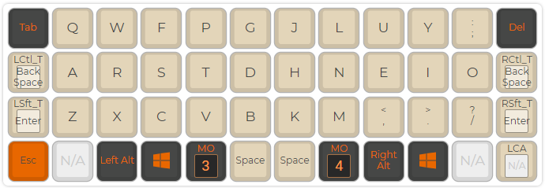
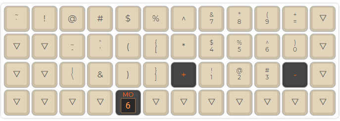
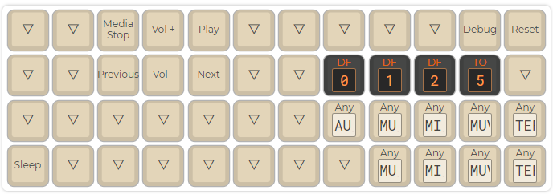

`Archived, see [codeberg repo](https://codeberg.org/Aoriseth/ambidex-colemak-planck-grid/issues)

# Ambidex Colemak Planck Grid

Layout and firmware for my custom ambidex colemak layout for the Planck

This layout is very similar to a normal colemak layout but uses numpad-like number/function key input. It also has navigation keys on the left hand homerow and ctrl/shift/alt/enter/backspace/windows keys on both sides.

## Instructions
1. Use [QMK Configurator](https://config.qmk.fm/#/planck/rev6/LAYOUT_ortho_4x12) and upload json
2. Generate corresponding bin file
3. Flash to keyboard with QMK toolbox

## Pictures (out of date)
  
  
  
  
