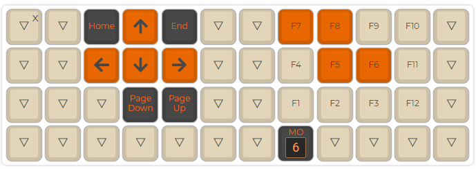

# Ambidex Colemak Planck Grid

Layout and firmware for my custom ambidex colemak layout for the Planck

This layout is very similar to a normal colemak layout but uses numpad-like number/function key input. It also has navigation keys on the left hand homerow and ctrl/shift/alt/enter/backspace/windows keys on both sides.

## Pictures
  
  
  
  